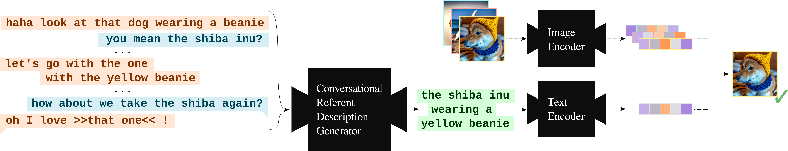

# Resolving References in Visually-Grounded Dialogue via Text Generation

🚧 **NOTE**: We are in the process of adding the material described in our paper to this repo. Our annotations for "[A Game Of Sorts](https://github.com/willemsenbram/a-game-of-sorts)" are already available.

Repository for the paper "[Resolving References in Visually-Grounded Dialogue via Text Generation](https://aclanthology.org/2023.sigdial-1.43/)" presented at [SIGDIAL 2023](https://2023.sigdial.org/). 
Please cite the following work if you use anything from this repository or from our paper:

```bibtex
@inproceedings{willemsen-etal-2023-resolving,
    title = "Resolving References in Visually-Grounded Dialogue via Text Generation",
    author = "Willemsen, Bram  and
      Qian, Livia  and
      Skantze, Gabriel",
    booktitle = "Proceedings of the 24th Meeting of the Special Interest Group on Discourse and Dialogue",
    month = sep,
    year = "2023",
    address = "Prague, Czechia",
    publisher = "Association for Computational Linguistics",
    url = "https://aclanthology.org/2023.sigdial-1.43",
    pages = "457--469"
}
```

***

## :scroll: Overview

- [:telescope: The Task](#the-task)
- [:page_facing_up: The Data](#the-data)
  - [A Game Of Sorts](#a-game-of-sorts)
  - [Our Annotations](#our-annotations)
- [:spaghetti: The Code](#the-code)
- [:books: Supplementary Material](#supplementary-material)

***

## <a name="the-task"></a> :telescope: The Task

In this paper, we treat visually-grounded reference resolution as a text-image retrieval task, where referents are represented by images.
We frame the discourse processing side of the task as a causal language modeling problem.
By fine-tuning an LLM for the purpose of referent description generation, we can augment the discourse processing capabilities of VLMs that have been pretrained to match relatively short, high-level descriptions with their associated images and have shown to be effective at zero-shot text-image retrieval based on such image descriptions, but that have not learned to process longer, conversational inputs.
Referent description generation can be regarded as a special case of referring expression generation with the goal of always generating the most complete expression possible.
For a given mention, the model is trained to generate a definite description that summarizes all information that has been explicitly disclosed about the referent during a conversation.
We will refer to the fine-tuned model as the *conversational referent description generator* (CRDG). 
The description generated by the CRDG is then used by a pretrained VLM to identify the referent, zero-shot. 

<div align="center"> <p>Figure 1: The proposed visually-grounded reference resolution framework. With the CRDG we generate a referent description for a marked mention, to be used by a (frozen) pretrained VLM for referent identification.</p></div>

Figure 1 shows a visualization of the proposed framework.
Our approach can be seen as an exploration of the limits of depending on linguistic context alone for generating referent descriptions, as the discourse processing and eventual grounding of the descriptions are entirely disjoint.
For a more formal task definition, we refer the reader to Section 3.1 of our [paper](https://aclanthology.org/2023.sigdial-1.43.pdf).

***

## <a name="the-data"></a> :page_facing_up: The Data

### <a name="a-game-of-sorts"></a> A Game Of Sorts

The data that were used for the fine-tuning and evaluation of our approach came from the collaborative image ranking task "[A Game Of Sorts](https://github.com/willemsenbram/a-game-of-sorts)".
For information about this task, we refer the reader to the "[Collecting Visually-Grounded Dialogue with A Game Of Sorts](https://aclanthology.org/2022.lrec-1.242/)" paper.


In order to reproduce our work and make effective use of our annotations, you will need the "[A Game Of Sorts](https://github.com/willemsenbram/a-game-of-sorts)" data:

```
git clone https://github.com/willemsenbram/a-game-of-sorts.git
```


In order to download the images, in the `./a-game-of-sorts/dataset/` directory, run:
```
bash get_images.sh
```
The images will be downloaded to `./a-game-of-sorts/dataset/images`.


### <a name="our-annotations"></a> Our Annotations

Span-based mention annotations aligned with the images they denote can be found in the `./annotations/data` directory.

The referent descriptions from the various sources as discussed in the paper, including the manually constructed "ground truth" labels that have been used for fine-tuning and evaluation, can be found in the `./descriptions/data` directory.

***

## <a name="the-code"></a> :spaghetti: The Code

***

## <a name="supplementary-material"></a> :books: Supplementary Material

The supplementary material (`supplementary_material.pdf`) covers additional details about our human evaluation as well as hyperparameters used for model fine-tuning.
